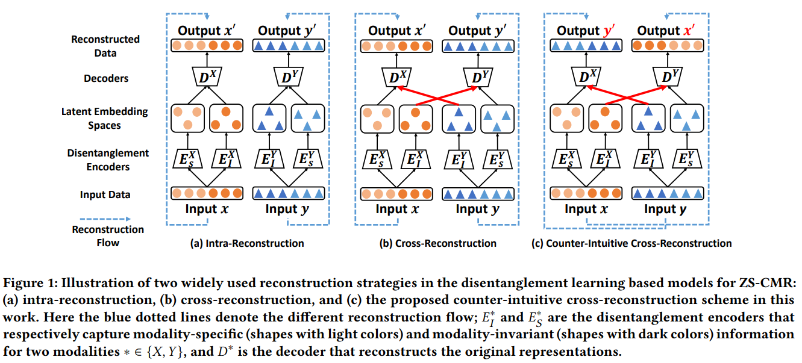
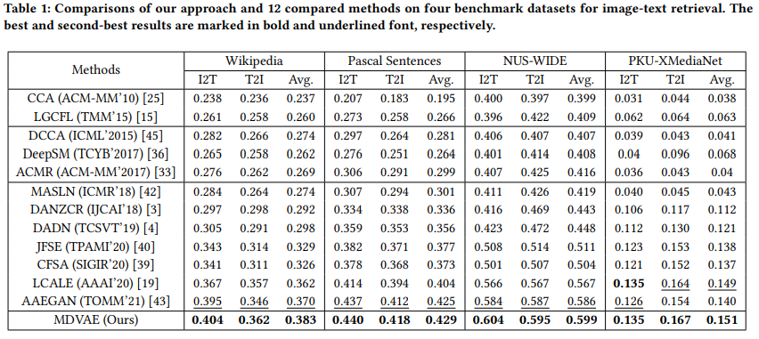
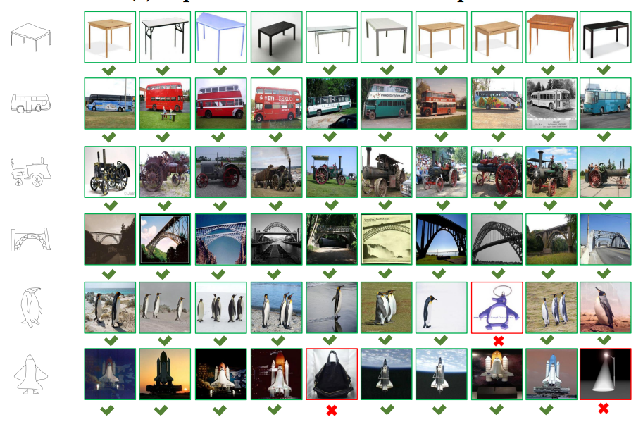

# Multimodal Disentanglement Variational AutoEncoders for Zero-Shot Cross-Modal Retrieval
This repository is the anonymous Pytorch implementation of the MDVAE method.

## Main Idea
In this work, we propose a novel ZS-CMR modeltermed Multimodal Disentanglement Variational AutoEncoders (MDVAE), which consists of two coupled disentanglement variational autoencoders (DVAEs) and a fusion-exchange VAE (FVAE). Specifically, DVAE is developed to disentangle the original representations of each modality into modality-invariant and modality-specific features. FVAE is designed to fuse and exchange information of multimodal data by the reconstruction and alignment process without pre-extracted semantic embeddings. Moreover, an advanced counter-intuitive cross-reconstruction scheme is further proposed to enhance the informativeness and generalizability of the modality-invariant features for more effective knowledge transfer. 
## The State-of-the-art Performance

## Visulization

## Installation and Requirements

### Installation

- Python 3.7
- PyTorch 1.8.1
- Numpy 1.22.0

### Prepare datasets and pre-trained models
Download **Sketchy Extended** and **TU-Berlin** dataset by following [SEM-PCYC](https://github.com/AnjanDutta/sem-pcyc).

### Training & Testing
 - >Training & Testing
   - Sketchy 

      `python main_sketch.py `

    - TU-Berlin

      `python main_tuberlin.py `

